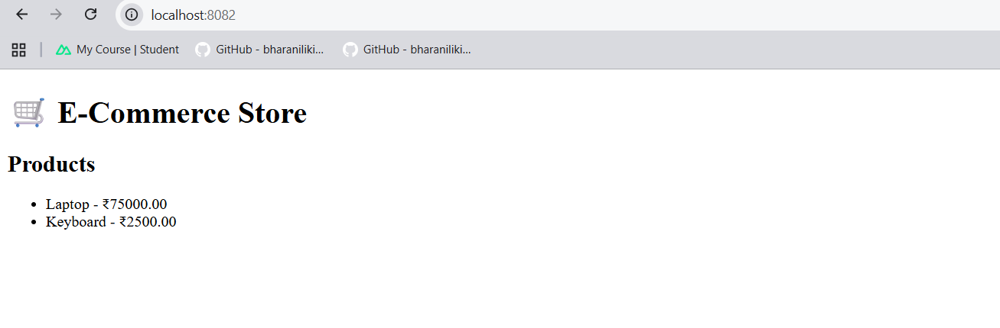
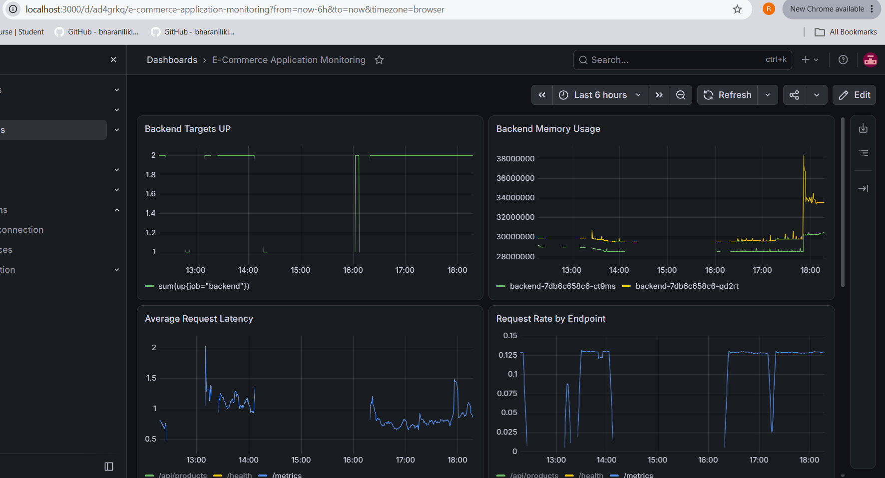
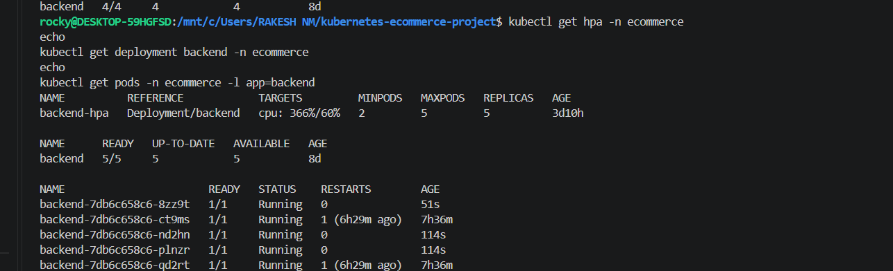

# Kubernetes E-Commerce DevOps Project

A self-initiated, hands-on DevOps portfolio project demonstrating how to containerize, deploy, operate, monitor, scale, secure, and back up a multi-component e-commerce application on Kubernetes.

The project was developed and tested locally using **Minikube** and is intended to demonstrate practical Kubernetes and DevOps skills rather than production/company experience.

---

## Table of Contents

- [Project Overview](#project-overview)
- [Architecture](#architecture)
- [Technology Stack](#technology-stack)
- [Kubernetes Implementation](#kubernetes-implementation)
- [Networking and Ingress](#networking-and-ingress)
- [Configuration and Secrets](#configuration-and-secrets)
- [Container Security](#container-security)
- [Health Probes](#health-probes)
- [Resource Management](#resource-management)
- [Horizontal Pod Autoscaling](#horizontal-pod-autoscaling)
- [Persistent Storage](#persistent-storage)
- [Database Backup](#database-backup)
- [RBAC](#rbac)
- [Monitoring and Observability](#monitoring-and-observability)
- [Grafana Dashboard](#grafana-dashboard)
- [Helm](#helm)
- [Security Cleanup Before GitHub](#security-cleanup-before-github)
- [Verification](#verification)
- [Troubleshooting Experience](#troubleshooting-experience)
- [Project Structure](#project-structure)
- [Future Improvements](#future-improvements)
- [Project Scope](#project-scope)

---

## Project Overview

The application consists of three main components:

| Component | Technology | Kubernetes Workload |
|---|---|---|
| Frontend | Nginx | Deployment |
| Backend | Python Flask | Deployment |
| Database | MySQL 8.0 | StatefulSet |

The project demonstrates:

- Kubernetes Deployments and StatefulSets
- Services and Ingress
- ConfigMap and Kubernetes Secret usage
- Readiness, liveness, and startup probes
- CPU and memory requests/limits
- Horizontal Pod Autoscaler (HPA)
- Persistent storage with PV/PVC/StorageClass
- Jobs and CronJobs
- RBAC
- Container security hardening
- Prometheus and Grafana
- Helm packaging and upgrades

---

## Architecture

### Application Flow

```text
                              User
                                |
                                v
                      Kubernetes Ingress
                         /            \
                        /              \
                       v                v
              Frontend Service      Backend Service
                     |                    |
                     v                    v
              Frontend Pods         Backend Pods
                                          |
                                          v
                                   MySQL Service
                                          |
                                          v
                                  MySQL StatefulSet
                                          |
                                          v
                                      mysql-pvc
                                          |
                                          v
                                  Persistent Storage
```

### Monitoring Flow

```text
Backend /metrics
       |
       v
 ServiceMonitor
       |
       v
 Prometheus
       |
       v
 Grafana
```

### Backup Flow

```text
MySQL Database
       |
       v
Backup Job / CronJob
       |
       v
  mysqldump
       |
       v
mysql-backup-pvc
```

---

## Technology Stack

| Area | Technology |
|---|---|
| Containerization | Docker |
| Orchestration | Kubernetes |
| Local Kubernetes | Minikube |
| Frontend | Nginx |
| Backend | Python Flask |
| Database | MySQL 8.0 |
| Package Management | Helm |
| Monitoring | Prometheus |
| Visualization | Grafana |
| Autoscaling | Kubernetes HPA |
| Storage | PV / PVC / StorageClass |
| Access Control | RBAC |
| Traffic Routing | Nginx Ingress |
| Version Control | Git / GitHub |

---

## Kubernetes Implementation

### Namespace

All application resources are deployed in:

```text
ecommerce
```

### Backend Deployment

| Setting | Value |
|---|---|
| Replicas | 2 |
| Image | `ecommerce-backend:1.3` |
| Container port | 5000 |
| Service port | 80 |

Resource configuration:

| Resource | Request | Limit |
|---|---:|---:|
| CPU | 100m | 500m |
| Memory | 128Mi | 256Mi |

The backend exposes:

```text
/health
/api/products
/metrics
```

### Frontend Deployment

| Setting | Value |
|---|---|
| Replicas | 2 |
| Image | `ecommerce-frontend:1.3` |
| Container port | 8080 |
| Service port | 80 |

### MySQL StatefulSet

| Setting | Value |
|---|---|
| Replicas | 1 |
| Image | `mysql:8.0` |
| Container port | 3306 |
| Database | `ecommerce` |

MySQL uses a headless Service and persistent storage.

---

## Networking and Ingress

### Services

| Service | Type | Port | Target Port |
|---|---|---:|---:|
| `frontend` | ClusterIP | 80 | 8080 |
| `backend` | ClusterIP | 80 | 5000 |
| `mysql` | Headless | 3306 | 3306 |

### Ingress Routing

The Nginx Ingress provides the application entry point.

| Request Path | Destination |
|---|---|
| `/api/*` | `backend` Service |
| `/*` | `frontend` Service |

The Ingress was tested through the Minikube address and successfully routed frontend and backend traffic.

---

## Configuration and Secrets

A ConfigMap named `ecommerce-config` contains non-sensitive application configuration:

| Key | Value |
|---|---|
| `APP_ENV` | `production` |
| `LOG_LEVEL` | `info` |
| `BACKEND_URL` | `http://backend` |

Sensitive database credentials are supplied through the Kubernetes Secret:

```text
db-secret
```

Real credentials are intentionally excluded from the GitHub repository.

The repository contains only:

```text
config/db-secret.example.yaml
```

with placeholder values.

---

## Container Security

### Backend

The backend container is configured to run as a non-root user:

| Security Setting | Configuration |
|---|---|
| UID | 1000 |
| GID | 1000 |
| `runAsNonRoot` | `true` |
| `allowPrivilegeEscalation` | `false` |
| Linux capabilities | All dropped |

### Frontend

The frontend Nginx container is also hardened:

| Security Setting | Configuration |
|---|---|
| `runAsNonRoot` | `true` |
| `allowPrivilegeEscalation` | `false` |
| Linux capabilities | All dropped |
| Seccomp | `RuntimeDefault` |

### MySQL Security Context

The official MySQL image was not forced into the same restrictive application-container security context. During testing, applying those restrictions caused MySQL initialization to fail with:

```text
setgid: Operation not permitted
```

The project therefore keeps the stronger security configuration on the application containers while allowing MySQL to use the official image's compatible runtime configuration.

---

## Health Probes

### Backend

Readiness probe:

```text
HTTP GET /health
```

Liveness probe:

```text
HTTP GET /health
```

### Frontend

HTTP readiness and liveness checks are performed against:

```text
/
```

on port `8080`.

### MySQL

MySQL uses:

- Startup probe
- Readiness probe
- Liveness probe

using:

```text
mysqladmin ping
```

---

## Resource Management

| Workload | CPU Request | Memory Request | CPU Limit | Memory Limit |
|---|---:|---:|---:|---:|
| Backend | 100m | 128Mi | 500m | 256Mi |
| Frontend | 100m | 128Mi | 500m | 256Mi |
| MySQL | 200m | 256Mi | 500m | 512Mi |

Requests and limits provide predictable scheduling and resource boundaries for the application workloads.

---

## Horizontal Pod Autoscaling

The backend uses Kubernetes HPA.

| HPA Setting | Value |
|---|---:|
| Minimum replicas | 2 |
| Maximum replicas | 5 |
| CPU target | 60% |

The HPA was tested with generated load and demonstrated scaling:

```text
2 -> 4 -> 5 replicas
```

After the load stopped, the deployment scaled back toward its configured minimum.

Verification:

```bash
kubectl get hpa -n ecommerce
```

Example current configuration:

```text
backend-hpa   Deployment/backend   cpu: 1%/60%   2   5   2
```

---

## Persistent Storage

### MySQL Data Storage

MySQL uses:

```text
mysql-pvc
```

| Setting | Value |
|---|---|
| Capacity | 1Gi |
| Access mode | ReadWriteOnce |
| StorageClass | standard |
| Status | Bound |

### Backup Storage

Database backups use:

```text
mysql-backup-pvc
```

| Setting | Value |
|---|---|
| Capacity | 1Gi |
| Access mode | ReadWriteOnce |
| StorageClass | standard |
| Status | Bound |

MySQL persistence was verified by recreating the StatefulSet and confirming that existing product data remained available.

The existing PVCs are intentionally reused by the Helm chart rather than recreated.

---

## Database Backup

A manual Kubernetes Job and a scheduled CronJob were implemented for MySQL backups.

### CronJob Configuration

| Setting | Value |
|---|---|
| Name | `mysql-backup-cronjob` |
| Schedule | `*/5 * * * *` |
| Concurrency policy | `Forbid` |
| Backup storage | `mysql-backup-pvc` |

The backup uses:

```text
--no-tablespaces
--single-transaction
--routines
--triggers
```

The backup workflow writes timestamped SQL dump files to the persistent backup volume and verifies that the generated file is non-empty.

The backup uses a temporary MySQL client option file with restrictive permissions instead of passing the database password through the `mysqldump` command line.

Successful Jobs were verified with:

```bash
kubectl get jobs -n ecommerce
```

---

## RBAC

The project includes:

| Resource | Name |
|---|---|
| ServiceAccount | `backup-sa` |
| Role | `backup-role` |
| RoleBinding | `backup-rolebinding` |

The namespace-scoped Role grants:

| Resource | Verbs |
|---|---|
| Pods | `get`, `list` |
| Jobs | `get`, `list` |

Secret access is not granted.

The RBAC configuration demonstrates least-privilege access. The backup container itself does not require Kubernetes API permissions to perform the database dump.

---

## Monitoring and Observability

The project uses:

- Prometheus
- Grafana
- kube-prometheus-stack

The Flask backend exposes Prometheus metrics at:

```text
/metrics
```

Custom application metrics include:

```text
http_requests_total
http_request_duration_seconds
```

Prometheus scraping is configured through:

```text
backend-servicemonitor
```

The ServiceMonitor is configured to scrape the backend metrics endpoint every 15 seconds.

### Useful PromQL Queries

#### Backend target availability

```promql
up{job="backend"}
```

#### Request rate

```promql
sum by (exported_endpoint) (
  rate(http_requests_total{job="backend"}[5m])
)
```

#### Average request latency in milliseconds

```promql
(
  sum by (exported_endpoint) (
    rate(http_request_duration_seconds_sum{job="backend"}[5m])
  )
  /
  sum by (exported_endpoint) (
    rate(http_request_duration_seconds_count{job="backend"}[5m])
  )
) * 1000
```

#### Error rate

```promql
(
  sum(rate(http_requests_total{job="backend",http_status=~"4..|5.."}[5m]))
  /
  sum(rate(http_requests_total{job="backend"}[5m]))
) * 100
```

#### Backend CPU usage

```promql
sum by (pod) (
  rate(container_cpu_usage_seconds_total{
    namespace="ecommerce",
    pod=~"backend-.*",
    cpu="total"
  }[5m])
)
```

#### Backend memory usage

```promql
sum by (pod) (
  container_memory_working_set_bytes{
    namespace="ecommerce",
    pod=~"backend-.*"
  }
)
```

#### HPA replica count

```promql
kube_deployment_status_replicas_available{
  namespace="ecommerce",
  deployment="backend"
}
```

---

## Grafana Dashboard

A Grafana dashboard named:

```text
E-Commerce Application Monitoring
```

was created with seven panels:

| # | Panel |
|---:|---|
| 1 | Backend Targets UP |
| 2 | Request Rate by Endpoint |
| 3 | Average Request Latency |
| 4 | Backend Error Rate |
| 5 | Backend CPU Usage |
| 6 | Backend Memory Usage |
| 7 | HPA Replica Count |

Grafana persistence was enabled with:

| Setting | Value |
|---|---|
| StorageClass | standard |
| Access mode | ReadWriteOnce |
| Size | 5Gi |

The Grafana persistence PVC is separate from the application's MySQL storage.

---

## Helm

The application is packaged as a Helm chart:

```text
helm/ecommerce/
```

The chart includes templates for:

- Namespace
- Backend Deployment
- Backend Service
- Frontend Deployment
- Frontend Service
- MySQL StatefulSet
- MySQL Service
- HPA
- Ingress
- CronJob
- RBAC
- ServiceMonitor
- ConfigMap
- Existing persistent storage references

### Helm Validation

The chart was validated with:

```bash
helm lint helm/ecommerce
```

Result:

```text
1 chart(s) linted, 0 chart(s) failed
```

### Helm Release

Current release:

| Setting | Value |
|---|---|
| Release | `ecommerce` |
| Namespace | `ecommerce` |
| Chart | `ecommerce-0.1.0` |
| Revision | 3 |
| Status | deployed |

The first Helm installation created Revision 1. A subsequent upgrade created Revision 2 after the backend image and security-related repository cleanup changes.

### Existing PVC Reuse

The chart is configured to reuse:

```text
mysql-pvc
mysql-backup-pvc
```

This avoids creating replacement storage during the Helm deployment.

---

## Security Cleanup Before GitHub

Before creating the GitHub repository, the project was cleaned to ensure real credentials are not committed.

The cleanup included:

1. Preserving the live Kubernetes `db-secret`.
2. Removing the plaintext Secret manifest from the repository.
3. Removing the Helm Secret template.
4. Adding `config/db-secret.example.yaml` with placeholder values.
5. Removing the hard-coded database password fallback from the Flask application.
6. Adding `.gitignore` rules for local secrets and environment files.
7. Upgrading the Helm release.
8. Verifying that the current Helm manifest no longer renders a Secret resource.
9. Verifying that the live Kubernetes Secret remains available to the workloads.

The secured backend image was rebuilt as:

```text
ecommerce-backend:1.3
```

and deployed successfully through Helm Revision 2.

---

## Verification

The following areas were successfully verified during the project:

| Area | Verification |
|---|---|
| Backend health | `/health` returned `{"status":"UP"}` |
| Backend product API | Product data returned successfully |
| MySQL connectivity | Backend successfully queried MySQL |
| MySQL data | Sample product records remained available |
| Frontend | Deployment healthy |
| Ingress | Frontend and `/api` routing verified |
| HPA | Scaling behavior tested |
| MySQL persistence | PVC remained Bound and data persisted |
| Backup | Backup Jobs completed successfully |
| Prometheus | Backend targets and application metrics scraped |
| Grafana | Dashboard and panels verified |
| Helm | Release deployed successfully |
| Helm lint | Passed with 0 failures |

Useful verification commands:

```bash
kubectl get pods -n ecommerce
kubectl get svc -n ecommerce
kubectl get pvc -n ecommerce
kubectl get hpa -n ecommerce
kubectl get ingress -n ecommerce
kubectl get cronjobs -n ecommerce
kubectl get servicemonitor -n ecommerce
helm status ecommerce -n ecommerce
helm history ecommerce -n ecommerce
```

---

## Troubleshooting Experience

Several practical Kubernetes troubleshooting scenarios were encountered and resolved during development.

### Ingress 503

The Ingress initially returned:

```text
503 Service Temporarily Unavailable
```

Troubleshooting focused on Services, selectors, endpoints, pod readiness, target ports, and Ingress routing.

### CrashLoopBackOff

Pod logs and descriptions were used to determine whether failures were related to application startup, configuration, images, probes, or dependencies.

### ImagePullBackOff

Local application images were built for the Minikube environment and configured for local image usage.

### HPA and PromQL Troubleshooting

Available Kubernetes and container metrics were inspected before building the final PromQL queries. CPU and memory queries were adapted to the metric labels available in the environment.

### Grafana Probe Failures

Grafana experienced probe failures while its sidecar/plugin components were loading. The relevant Grafana sidecar probes were adjusted through Helm, after which the Grafana pod returned to a healthy state.

### MySQL Security Context Compatibility

Applying the same restrictive security model used by the application containers to the official MySQL image caused:

```text
setgid: Operation not permitted
```

The MySQL security configuration was therefore adjusted to remain compatible with the official image.

### Minikube Restart and Context Recovery

After Minikube was stopped, the active Kubernetes context was unavailable. Restarting Minikube and restoring the Minikube context returned the cluster to normal operation. Persistent claims remained intact.

### PVC Verification

PVC status, StorageClass, events, access modes, and mounts were checked when validating persistent storage.

### Backup Job Troubleshooting

Some backup pods initially showed transient errors, while the corresponding Jobs later completed successfully. Job status was verified directly rather than relying only on individual pod status.

---

## Project Screenshots

### E-Commerce Application



### Grafana Dashboard



### HPA Scaling



## Project Structure

```text
kubernetes-ecommerce-project/
│
├── backend/
│   ├── Dockerfile
│   ├── deployment.yaml
│   ├── service.yaml
│   └── app/
│       ├── app.py
│       └── requirements.txt
│
├── frontend/
│   ├── Dockerfile
│   ├── deployment.yaml
│   ├── service.yaml
│   └── app/
│       └── index.html
│
├── database/
│   ├── service.yaml
│   └── statefulset.yaml
│
├── storage/
│   └── mysql-pvc.yaml
│
├── config/
│   ├── app-config.yaml
│   └── db-secret.example.yaml
│
├── autoscaling/
│   └── backend-hpa.yaml
│
├── ingress/
│   └── ecommerce-ingress.yaml
│
├── jobs/
│   ├── backup-pvc.yaml
│   ├── mysql-backup-job.yaml
│   └── mysql-backup-cronjob.yaml
│
├── monitoring/
│   └── backend-servicemonitor.yaml
│
├── security/
│   ├── backup-role.yaml
│   ├── backup-rolebinding.yaml
│   └── backup-serviceaccount.yaml
│
├── helm/
│   └── ecommerce/
│       ├── Chart.yaml
│       ├── values.yaml
│       └── templates/
│
├── docs/
│
├── namespace.yaml
├── .gitignore
└── README.md
```

---

## Future Improvements

The following are possible extensions and are **not represented as currently implemented production capabilities**:

- Jenkins CI/CD
- Terraform-based infrastructure
- Ansible automation
- AWS / EKS deployment
- Container registry integration
- TLS-enabled Ingress
- Centralized logging
- Alerting
- Dedicated secret-management solution

---

## Project Scope

This is a **self-initiated local hands-on DevOps project** created for learning and portfolio demonstration.

It should not be represented as production infrastructure or as professional production experience.

The project demonstrates practical experience with:

- Kubernetes
- Docker
- Helm
- Observability
- Container security
- Persistent storage
- Autoscaling
- Database backups
- Kubernetes troubleshooting
